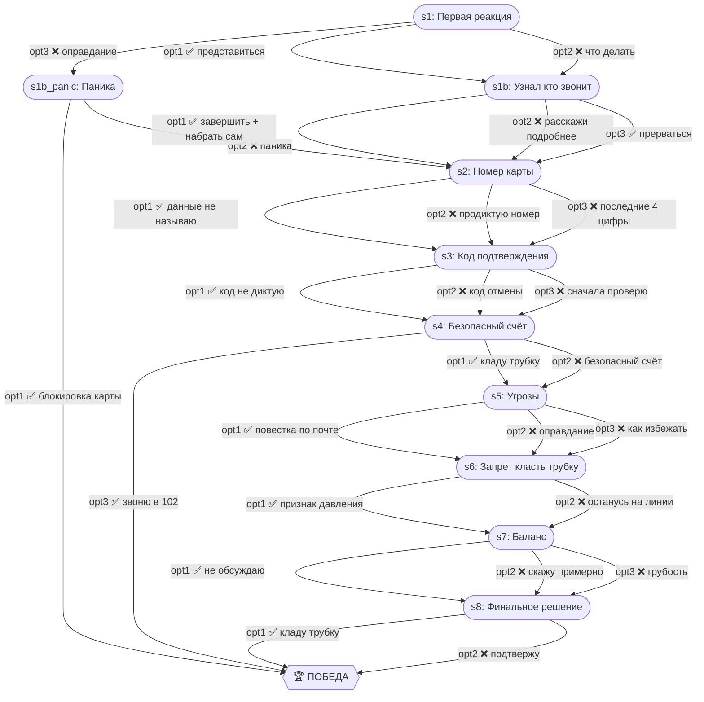

# Звонок из банка

| Поле | Значение |
|---|---|
| ID | `bank-call` |
| Шагов | 10 (s1–s8 + s1b + s1b_panic) |
| Досрочных побед | 3 (s1b_panic, s4, s8) |
| Жизней | 3 |

## Граф ветвления

## Ветки

- **s1 → s1b** — штатная проверка собеседника
- **s1 → s1b_panic** — оправдание приводит к эмоциональной ветке (с ранним win при блокировке карты)
- **s4 opt3** — звонок в 102 = мгновенная победа
- **s8** — штатная победа независимо от выбора (opt2 идёт с -1 жизнь)

## Примечание

Каждый неверный ответ стоит 1 жизни. Проигрыш — только когда lives = 0. Timeout = -1 жизнь + автоматический переход по safe-ветке.
