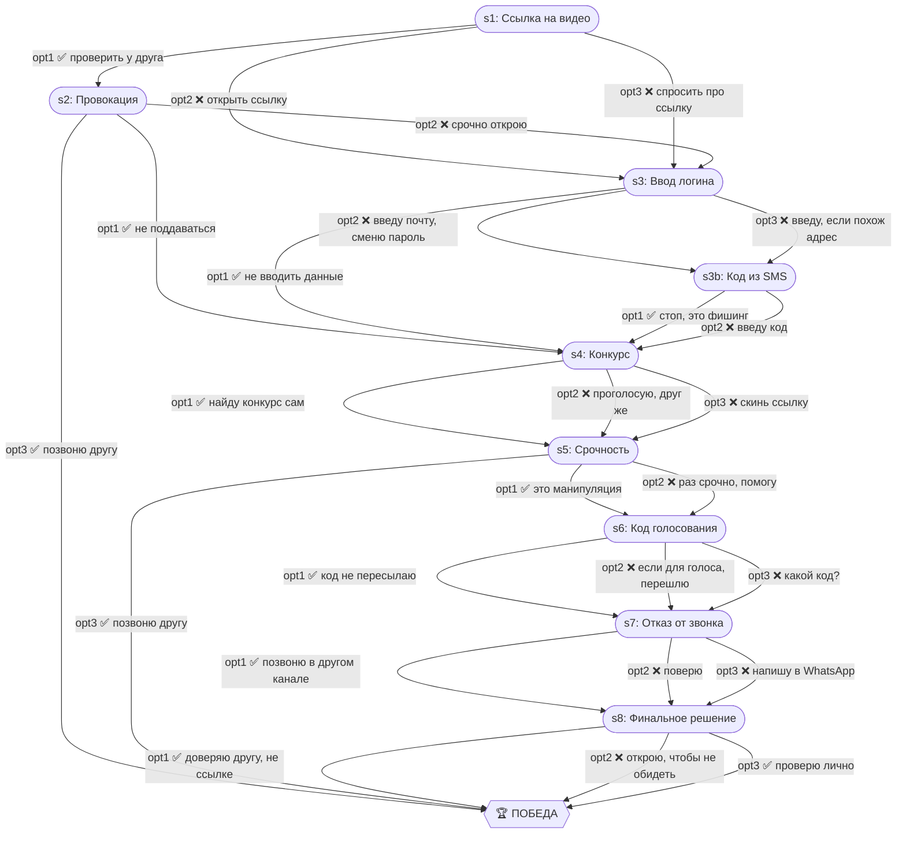

# Сообщение от друга

| Поле | Значение |
|---|---|
| ID | `friend-link` |
| Шагов | 9 (s1–s8 + s3b) |
| Досрочных побед | 3 (s2, s5, s8) |
| Жизней | 3 |

## Граф ветвления

## Ветки

- **s3 → s3b** — мини-ветка для тех, кто ввёл данные на фишинговой странице (шанс опомниться)
- **s2 opt3** — прямой звонок другу = ранняя победа
- **s5 opt3** — звонок другу про конкурс = ранняя победа
