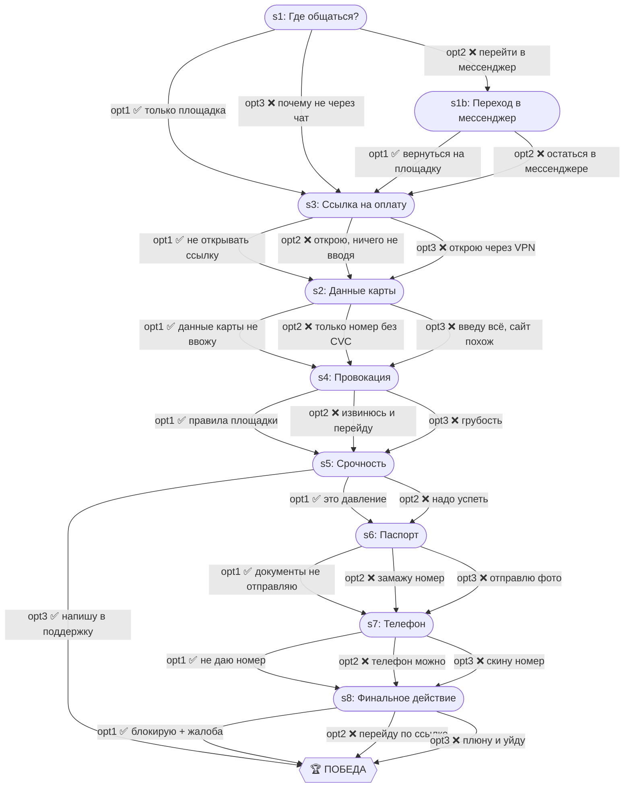

# Фейковые покупатели на Kufar

| Поле | Значение |
|---|---|
| ID | `kufar-buyers` |
| Шагов | 9 (s1–s8 + s1b) |
| Досрочных побед | 2 (s5, s8) |
| Жизней | 3 |

## Граф ветвления

## Ветки

- **s1 → s1b** — мини-ветка для тех, кто согласился перейти в мессенджер (возврат к безопасному пути)
- **s5 opt3** — обращение в поддержку площадки = ранняя победа

## Примечание

Каждый неверный ответ стоит 1 жизни. Проигрыш — только когда lives = 0. Timeout = -1 жизнь + автоматический переход по safe-ветке.
