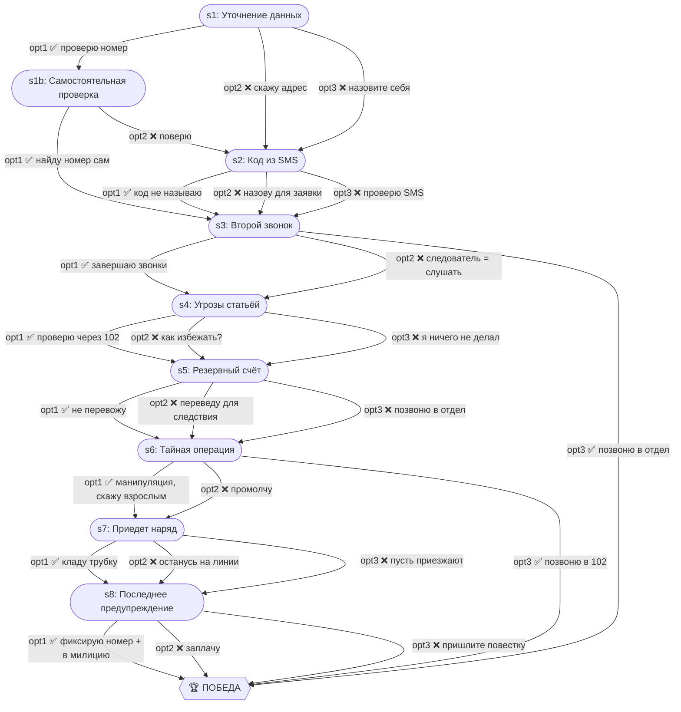

# Счётчик, домофон и «следователь»

| Поле | Значение |
|---|---|
| ID | `meter-investigator` |
| Шагов | 9 (s1–s8 + s1b) |
| Досрочных побед | 3 (s3, s6, s8) |
| Жизней | 3 |

## Граф ветвления

## Ветки

- **s1 → s1b** — мини-ветка для тех, кто попросил официальный номер (самостоятельная проверка)

## Ранние победы

- **s3 opt3** — проверка следователя через официальный отдел
- **s6 opt3** — звонок в 102 для проверки «тайной операции»
