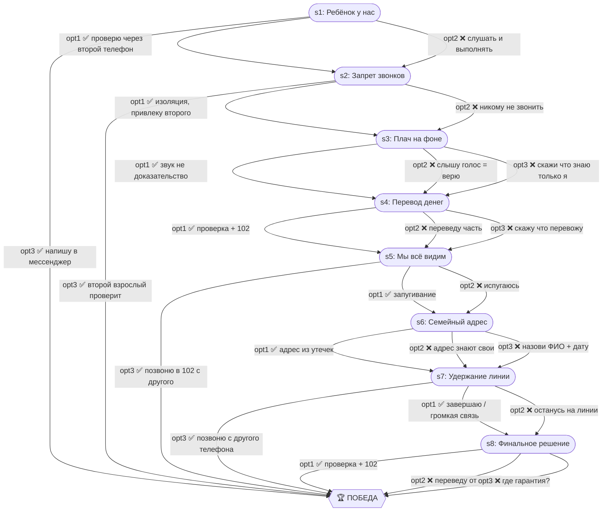

# Шантаж родителей похищением

| Поле | Значение |
|---|---|
| ID | `parent-kidnap` |
| Шагов | 8 (s1–s8) |
| Досрочных побед | 3 (s1, s2, s5, s7) |
| Жизней | 3 |

## Граф ветвления

## Ранние победы

- **s1 opt3** — написать в мессенджер ребёнку
- **s2 opt3** — подключить второго взрослого к проверке
- **s5 opt3** — звонок в 102 с другого номера
- **s7 opt3** — звонок родственнику с другого телефона
