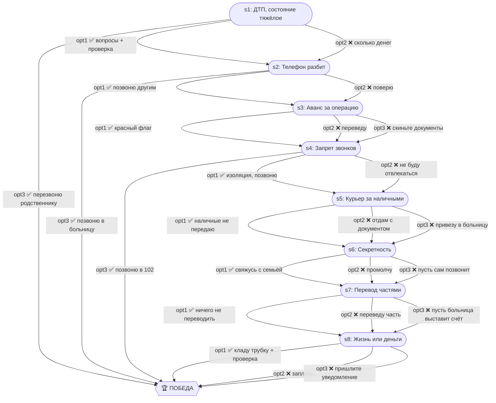

# Родственник попал в ДТП

| Поле | Значение |
|---|---|
| ID | `relative-accident` |
| Шагов | 8 (s1–s8) |
| Досрочных побед | 3 (s1, s2, s4) |
| Жизней | 3 |

## Граф ветвления

## Ранние победы

- **s1 opt3** — перезвонить родственнику напрямую
- **s2 opt3** — позвонить в больницу для проверки
- **s4 opt3** — звонок в 102
