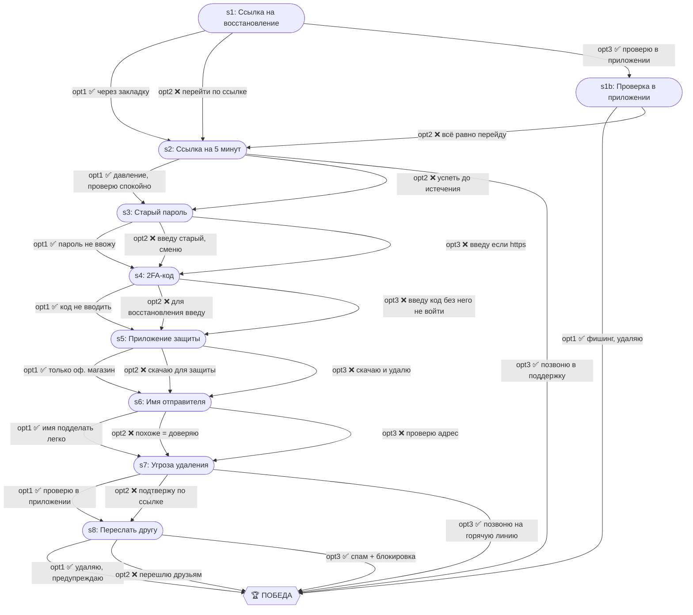

# SMS о взломе аккаунта

| Поле | Значение |
|---|---|
| ID | `sms-hack-link` |
| Шагов | 9 (s1–s8 + s1b) |
| Досрочных побед | 3 (s1b, s2, s7) |
| Жизней | 3 |

## Граф ветвления

## Ветки

- **s1 → s1b** — мини-ветка для тех, кто решил проверить через официальное приложение (ранняя победа при отсутствии уведомлений)

## Ранние победы

- **s1b opt1** — проверка в приложении подтвердила, что взлома нет
- **s2 opt3** — звонок в поддержку сервиса
- **s7 opt3** — звонок на горячую линию
